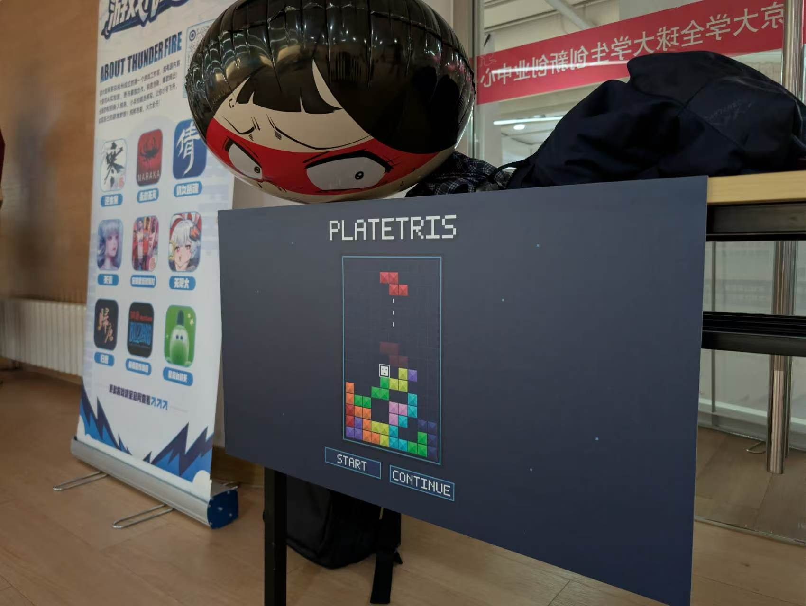
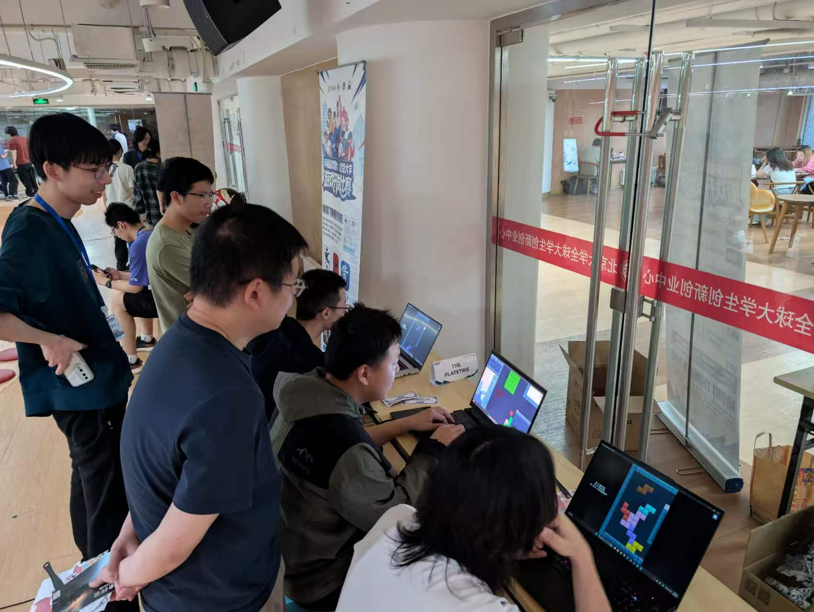
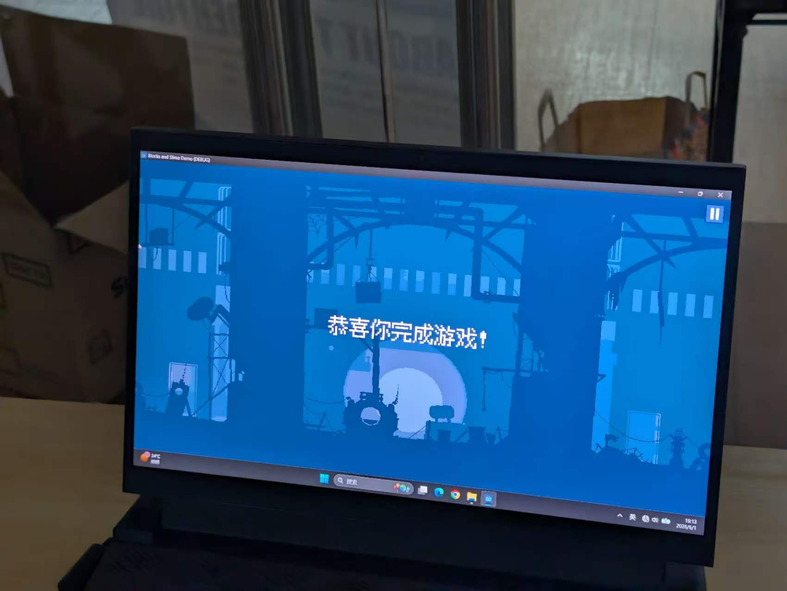
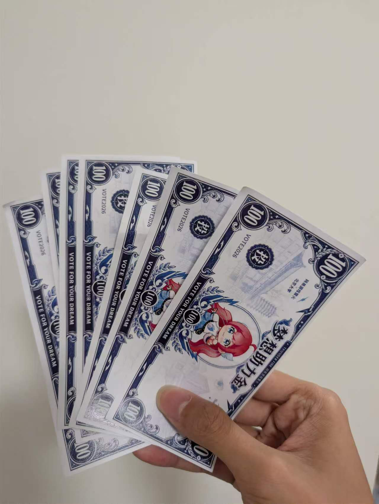

第一次Gamejam，心情复杂，辗转反侧，仅靠朋友圈难以言说，遂在此记录以抒发心情

没有什么逻辑，想到啥就写啥吧

## 关于过程

从最开始遇到队长，被他的游戏创意惊为天人，觉得简直就是天才；

中期前各种忙里偷闲，忙前忙后就是不忙游戏，游戏进度龟速成长；

到结束前一星期，美术跑路，进度缓慢，各种DDL，还有其他各种糟心事叠在一起，经历今年甚至两年以来最破防的一周，就这样崩溃着还得一边搞程序一边弄美术。（我难以用语言描述我那周有多崩溃，反正我回忆不起来了，也不想回忆）

直到提交游戏，如释重负，赶紧找哥们姐们试玩，得到各种反馈和评价，心情从未如此愉悦，从未有过如此美妙的一天！

## 关于展会

运气很好，展位就在门口右侧

或许是游戏的色彩很吸睛，或许是游戏的创意一目了然，或许是因为我们的位置优势

总之，占据着天时地利人和，摊位比我想象中来得热门，甚至需要借一部电脑来扩充摊位

甚至还有通关的哥们，太强了，可惜没拍到哥们的照片

自从到北大留学以来，从几乎无法适应新地方的学习强度，到现在勉勉强强混过去，苟活着各种期中期末。

我似乎在这过程中丢失了什么，热爱、动力、自信？说不清楚。

但我知道，我很久很久没有发自内心的去追求某一件事了

今天，我似乎重新找回了什么东西

我看着 PLATETRIS 展位前的众生相

玩家绞尽脑汁通过一个又一个关卡

旁观者对着电脑前的玩家指点江山

一对哥们互相嘲讽对方的操作智商

参展者们互相交流着游戏设计灵感

策划在速通着展示各个关卡的解法

工作人员带着摄像机怼着电脑直播

现场玩家给我们的赞许和一张张票

嗯，很好，一切都很好

## 关于奖项

坦白地说，我一开始觉得，这游戏能做出来，能被朋友们体验到，就已经很爽了

奖项？Whatever。这是第一次gamejam，制作过程如此糟心，美术不如一众美术大佬，游戏没啥技术力，成果也不完整，反正游戏能玩好玩就是胜利

但是

我看着朋友们对游戏的积极反馈和认可

我看着队长对游戏的自信，立Flag说着我们保底能拿500块

我看着展会中我们的游戏好评如潮，看着人满为患的展位，看着大家对游戏的热情讨论

或许呢？

或许真的有那个机会呢？

我是不是应该自信一点？

我如此的期待着。

直到尘埃落定，期待落空，如梦初醒，终究是棋差一着，技不如人

---

无论如何，我相信

终有那么一天，这份期待将会实现

这篇随笔，是第一篇，也一定会有下一篇

感谢zjh队长，感谢愿意借电脑设备的mhy，感谢所有愿意参与测试的哥们姐们，感谢所有在展会中支持我们的玩家，感谢codex和gpt助我成为天才程序员

感谢愿意阅读到这里的你

今天是最美好的一天

今天是最难忘的一天

今天是最遗憾的一天
