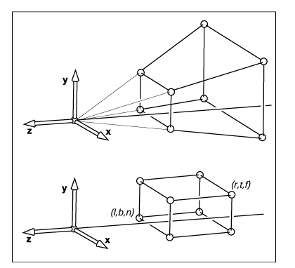
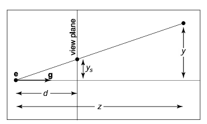
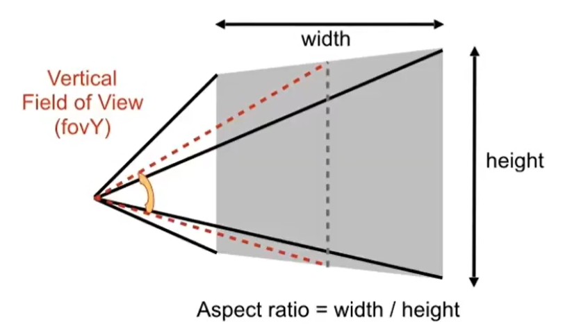

<!-- synced-from-obsidian -->
# GAMES101 2-三维变换

## 核心问题/Motivation

图形学要把世界中的三维几何显示成二维图像。这个过程的数学骨架是使用 MVP：
- Model 负责把模型放进世界
- View 负责把世界放到相机坐标系
- Projection 负责把可见空间压到标准立方体
后续光栅化再把标准坐标映射到屏幕像素。

## 三维齐次变换

三维点与向量分别写作：

$$
\text{point}=\begin{bmatrix}x\\y\\z\\1\end{bmatrix},\qquad
\text{vector}=\begin{bmatrix}x\\y\\z\\0\end{bmatrix}
$$

三维仿射变换统一写成 $4\times4$ 矩阵，其中左上角 $3\times3$ 线性部分表示旋转、缩放、剪切，最后一列表示平移。

> [!note] 直觉理解
> $w=0$ 的向量不会受到平移项影响，所以方向、法线、速度这类对象不会因为坐标原点移动而改变。

### 三维旋转矩阵

绕 $x,y,z$ 轴的旋转矩阵可嵌入 $4\times4$ 齐次矩阵。以 $z$ 轴为例：

$$
R_z(\alpha)=
\begin{bmatrix}
\cos\alpha&-\sin\alpha&0&0\\
\sin\alpha&\cos\alpha&0&0\\
0&0&1&0\\
0&0&0&1
\end{bmatrix}
$$

> [!warning] 易错点
> 绕不同轴的旋转通常不可交换。欧拉角的结果依赖旋转顺序，写代码时要和课程、框架、作业约定保持一致。

## Rodrigues 旋转公式

绕单位轴 $\mathbf{n}$ 旋转角度 $\alpha$ 的三维旋转矩阵为：

$$
R(\mathbf{n},\alpha)=\cos\alpha I+(1-\cos\alpha)\mathbf{n}\mathbf{n}^T+\sin\alpha
\begin{bmatrix}
0&-n_z&n_y\\
n_z&0&-n_x\\
-n_y&n_x&0
\end{bmatrix}
$$

该公式直接描述任意轴旋转，避免把旋转拆成多个坐标轴旋转。

## MVP 变换

列向量约定下，一个顶点从模型空间到裁剪空间常写作：

$$
\mathbf{p}_{clip}=M_{projection}M_{view}M_{model}\mathbf{p}_{model}
$$

含义是先做**模型变换**，再做**视图变换**，最后做**投影变换**

### 模型视图变换 ModelView Transformation

视图变换把世界坐标变成相机坐标。给定相机位置 $\mathbf{e}$、观察方向 $\mathbf{g}$、上方向 $\mathbf{t}$，目标是把相机移动到原点，使其朝向标准的 $-z$ 方向，上方向对齐 $y$ 轴。

GAMES101 相机视图变换.relationship

视图矩阵通常分为两步：

$$
M_{view}=R_{view}T_{view}
$$

其中 $T_{view}$ 把相机位置平移到原点，$R_{view}$ 用相机的正交基把 $\mathbf{g}$、$\mathbf{t}$ 与 $\mathbf{g}\times\mathbf{t}$ 对齐到标准坐标轴。

> [!note] 直觉理解
> 与其移动相机去看世界，不如把整个世界反向移动，让相机固定在原点。渲染管线采用后者，因为所有顶点都能被同一个矩阵处理。
##### $T_{view}$ 平移变换
**目标**：把相机移动到原点
$$
T_{view} = \begin{pmatrix}
1 & 0 &  0 & -x_{e} \\
0 & 1 &  0 & -y_{e}  \\
0 & 0 &  1 & -z_{e}  \\
0 & 0 &  0 & 1
\end{pmatrix}
$$

##### $R_{view}$ 旋转变换
**目标**：把  $\mathbf{g}$、$\mathbf{t}$ 与 $\mathbf{g}\times\mathbf{t}$ 分别旋转到 $-z,y,x$
与其考虑计算  $\mathbf{g}$、$\mathbf{t}$ 与 $\mathbf{g}\times\mathbf{t}$ 旋转到 $-z,y,x$ 的**旋转矩阵**
不如考虑其**更简单的逆变换**，即从标准坐标轴旋转到   $\mathbf{g}$、$\mathbf{t}$ 与 $\mathbf{g}\times\mathbf{t}$  的旋转矩阵：
$$
R_{view}^{-1} = \begin{pmatrix}
x_{\mathbf{g}\times\mathbf{t}}  & x_{\mathbf{t}} & x_\mathbf{g} & 0\\
y_{\mathbf{g}\times\mathbf{t}}  & y_{\mathbf{t}} & y_{\mathbf{g}} & 0\\
z_{\mathbf{g}\times\mathbf{t}} & z_{\mathbf{t}}  & z_{\mathbf{g}} & 0\\
0 & 0 & 0 & 1
\end{pmatrix}
$$
而因为旋转矩阵是正交矩阵 $R_{view}^{-1}=R_{view}^{T}$，那么 
$$
R_{view} = \begin{pmatrix}
x_{\mathbf{g}\times\mathbf{t}}  & y_{\mathbf{g}\times\mathbf{t}} & z_{\mathbf{g}\times\mathbf{t}} & 0\\
x_{\mathbf{t}}  & y_{\mathbf{t}} & z_{\mathbf{t}} & 0\\
x_\mathbf{g}  & y_{\mathbf{g}}   & z_{\mathbf{g}} & 0\\
0 & 0 & 0 & 1
\end{pmatrix}
$$

### 投影变换 Projection Transformation

投影把相机坐标系中的可见空间变成标准立方体。GAMES101 先讲正交投影，再讲透视投影，因为透视投影可以分解为“挤压视锥体”加“正交投影”。

#### 正交投影 Orthographic Projection

正交投影视体是一个长方体，投影方向互相平行，因此不会出现近大远小。

GAMES101 正交投影视体盒.relationship

给定视体边界 $l,r,b,t,n,f$，正交投影做两件事：先把长方体中心平移到原点，再缩放到 $[-1,1]^3$。

$$
M_{ortho}=S_{ortho}T_{ortho}
$$

> [!warning] 易错点
> 不同图形 API 对 $z$ 方向和左右手坐标系的约定可能不同。先跟随推导约定，工程中再查具体 API。
##### $T_{ortho}$ 平移变换
**目标**：长方体中心移动到原点
$$
T_{ortho} = \begin{pmatrix}
1 & 0 &  0 & - \frac{l+r}{2} \\
0 & 1 &  0 & -\frac{b+t}{2} \\
0 & 0 &  1 & -\frac{f+n}{2} \\
0 & 0 &  0 & 1
\end{pmatrix}
$$
##### $S_{ortho}$ 缩放变换
**目标**：长方体缩放为长、宽、高各为 2 的立方体
$$
S_{ortho} = \begin{pmatrix}
\frac{2}{r-1} & 0 &  0 & 0\\
0 & \frac{2}{t-b} &  0 & 0 \\
0 & 0 &  \frac{2}{n-f} & 0 \\
0 & 0 &  0 & 1
\end{pmatrix}
$$
#### 透视投影 Perspective Projection

透视投影的视体是一个截头锥体，近处物体投到成像平面上更大，远处物体更小。

透视投影可先把视锥体挤压成正交投影可处理的长方体，再套用正交投影：

$$
M_{persp}=M_{ortho}M_{persp\rightarrow ortho}
$$

核心挤压矩阵形式为：

$$
M_{persp\rightarrow ortho}=
\begin{bmatrix}
n&0&0&0\\
0&n&0&0\\
0&0&n+f&-nf\\
0&0&1&0
\end{bmatrix}
$$

### $M_{persp\rightarrow ortho}$ 推导
##### 从相似三角形透视方程推导

$y$ 和 $x$ 投影在 view plane 上的大小和 $z$ 成反比
即
$$
x_{s} =  \frac{d}{z}x ,y_{s} =  \frac{d}{z}y
$$

定义矩阵 $\begin{pmatrix}\tilde{x},\tilde{y},\tilde{z},w \end{pmatrix}$ 在坐标系上：
$$
\begin{pmatrix}
x,y,z 
\end{pmatrix} = \begin{pmatrix}
\frac{\tilde{x}}{w},\frac{\tilde{y}}{w},\frac{\tilde{z}}{w}
\end{pmatrix}
$$
即在坐标系上，这两个矩阵表示同一个点
$$
\begin{pmatrix}
\frac{\tilde{x}}{w},\frac{\tilde{y}}{w},\frac{\tilde{z}}{w},1
\end{pmatrix} = \begin{pmatrix}\tilde{x},\tilde{y},\tilde{z},w \end{pmatrix}
$$

已知 $x_{s} =  \frac{d}{z}x ,y_{s} =  \frac{d}{z}y$，同时相机以近平面作为 view plane ，因此 $d=n$
把视锥体挤压成正交投影的变换，意味着把点 $(x,y,z,1)$ 变换为 $(nx,ny,?,z)$：
$$
\begin{pmatrix}
nx \\
ny \\
unknown \\
z
\end{pmatrix} = \begin{pmatrix}
n & 0 & 0 & 0 \\
0 & n & 0 & 0 \\
? & ? & ? & ? \\
0 & 0 & 1 & 0
\end{pmatrix}\begin{pmatrix}
x \\
y \\
z \\
1
\end{pmatrix}
$$

##### 从 z 在近平面和远平面得不变性推导
**目标**：近平面上 $z$ 不变，远平面上 $z$ 也不变
近平面上 $z=n$，远平面上 $z=f$ 
即
$$
\begin{pmatrix}
nx \\
ny \\
z^{2} \\
z
\end{pmatrix} = \begin{pmatrix}
n & 0 & 0 & 0 \\
0 & n & 0 & 0 \\
0 & 0 & A & B \\
0 & 0 & 1 & 0
\end{pmatrix}\begin{pmatrix}
x \\
y \\
z \\
1
\end{pmatrix}
$$
$$
\begin{align}
\begin{pmatrix}
0 & 0 & A & B
\end{pmatrix}\begin{pmatrix}
x \\
y \\
n \\
1
\end{pmatrix}   &  = n^{2}   & \begin{pmatrix}
0 & 0 & A & B
\end{pmatrix}\begin{pmatrix}
x \\
y \\
f \\
1
\end{pmatrix}   & = f^{2} \\
An + B  &  = n^{2}   & Af + B  & = f^{2} \\
\end{align} 
$$
得 $A=n+f,B=-fn$
那么挤压矩阵为：
$$
M_{persp\rightarrow ortho}=
\begin{bmatrix}
n&0&0&0\\
0&n&0&0\\
0&0&n+f&-nf\\
0&0&1&0
\end{bmatrix}
$$

> [!note] 直觉理解
> 透视投影的近大远小来自相似三角形。物体越远，投影到近裁剪平面上的比例越小。

### 对称场景下的投影变换
我们使用 (l、r、b、t) 和 n 值指定窗口大小
但更多情况下，我们希望直接从窗口的中心查看。这意味着约束：
$$
l=-r , b = -t
$$

此时，只需给定宽高比 aspect ratio ，视角 field of view 和 $n$
就能计算：

GAMES101 视角和宽高比
$$
\begin{align}
\tan\left(  \frac{fov}{2} \right) = \frac{t}{|n|} \\
aspect = \frac{r}{t}
\end{align}
$$

## 像素 (PIXEL, "picture element")

每个像素都是一个**有单一颜色的方块**
颜色由 RGB 定义
## 屏幕空间

屏幕空间用像素为单位描述点的位置。像素中心位于整数坐标，整个图像边界比最小/最大像素中心多出半个单位。因此当画面大小为 $n_x \times n_y$ 时，$[-1,1]^2$ 被映射到 $[-0.5,n_x-0.5]\times[-0.5,n_y-0.5]$。
### 视口变换

GAMES101 视口变换与像素坐标.relationship

视口矩阵可写为：

$$
M_{vp}=
\begin{bmatrix}
\frac{n_x}{2} & 0 & 0 & \frac{n_x-1}{2}\\
0 & \frac{n_y}{2} & 0 & \frac{n_y-1}{2}\\
0 & 0 & 1 & 0\\
0 & 0 & 0 & 1
\end{bmatrix}
$$
其中 $z$ 被原样保留下来，因为后续深度测试需要知道哪个 fragment 更靠近相机。
##### 视口变换推导
**目标**：对 $x$ 方向，要求 $x_{ndc}=-1$ 映射到 $x_{screen}=-0.5$，$x_{ndc}=1$ 映射到 $x_{screen}=n_x-0.5$。令：

$$
x_{screen}=a x_{ndc}+b
$$

代入两端点：

$$
\begin{aligned}
-a+b&=-0.5\\
a+b&=n_x-0.5
\end{aligned}
$$

两式相减得 $2a=n_x$，所以 $a=\frac{n_x}{2}$；代回得 $b=\frac{n_x-1}{2}$。
同理：
$$
y_{screen}=\frac{n_y}{2}y_{ndc}+\frac{n_y-1}{2}
$$

这正是视口矩阵前两行的来源。

> [!warning] 易错点
> 视口变换不再处理透视关系；透视已经在 Projection 和 perspective divide 中完成。Viewport 只负责把标准坐标缩放、平移到像素坐标。

### 投影类型速查

| 类型 | 视体形状 | 几何效果 | 典型用途 |
|---|---|---|---|
| 正交投影 | 长方体 | 尺寸与深度无关，平行线保持平行 | CAD、工程图、部分 UI/策略游戏 |
| 透视投影 | 截头锥体 | 近大远小，符合人眼和相机直觉 | 游戏、电影、真实感渲染 |

### 结论：
- 三维仿射变换统一写成 $4\times4$ 矩阵，前三行三列表示旋转、缩放，最后一列表示平移
- 视口变换把 $[-1,1]^2$ 映射到像素坐标，同时保留 $z$ 供深度测试。
